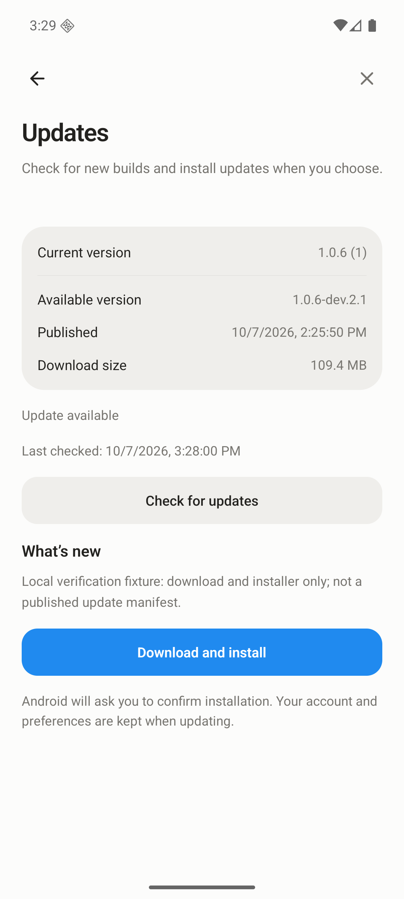
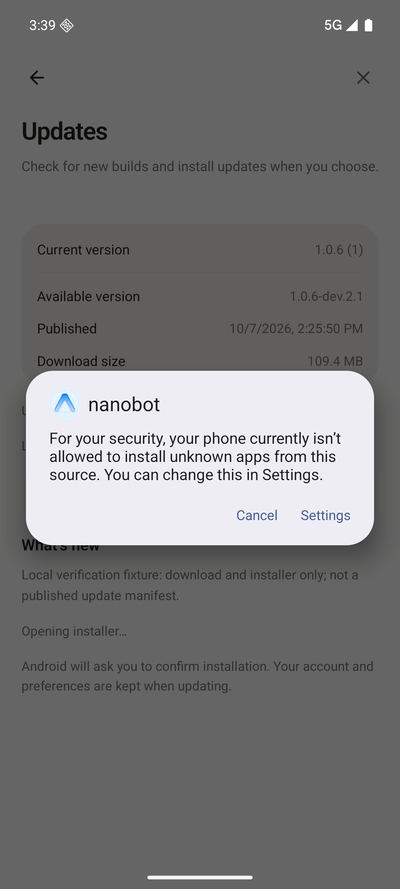

# Android 应用内更新验收（2026-10-07）

> 历史记录：本页验证的是重构前的 Release 列表/嵌套清单实现，不代表本次简化版或线上新版已经通过端到端升级。当前方案见 `docs/in-app-updates.md`。

## 环境和验收边界

- Expo SDK 57 / React Native 0.86.2，Android API 36 x86_64 模拟器。
- 本地 Debug / Release 原生版本：1.0.6，versionCode 1；包名与已有开发版签名保持一致。
- 未提交、推送或触发新的 GitHub Actions 发布；不把本地结果当作云端新工作流成功运行。
- 线上现有开发版没有 update.json。真实 GitHub 查询能成功，客户端正确显示“尚无已发布的兼容更新”，没有将旧 APK 误判为可更新版本。
- 为验收真实下载与系统安装器，将经过协议校验的候选数据写入模拟器更新缓存，指向同仓库现有开发 APK。这是本地验收 fixture，不是通过线上清单发现新版本的证据。

## 自动化与构建

| 检查 | 结果 |
| --- | --- |
| npm run check（lint、TypeScript、Vitest、Native、Android bundle smoke） | 全部通过，退出码 0 |
| Vitest | 38 个文件、300 项通过 |
| Native Jest | 10 个套件、119 项通过 |
| Android Debug / Release 原生构建 | 均成功，未重配全局 Java / SDK 环境 |
| actionlint / 清单 CLI 工具烟测 | 通过 |
| git diff --check | 通过 |
| expo-doctor | 20/21；现有 Expo / RN 依赖有 patch 更新建议，未在更新功能中顺手升级整套依赖 |

测试涵盖版本码排序、分页、清单和签名约束、限流退避、并发请求合并、下载取消、真实 SHA-256、坏缓存、存储不足、安装参数、前后台生命周期与 UI 状态。

## 模拟器操作

- Debug 重新构建安装后，设置页更新入口、详情返回导航、当前原生版本、手动检查均正常。
- Metro 开发模式允许检查，禁用下载与安装；新增原生模块无缺失错误。
- Release 包用覆盖安装方式装入，不清空已有应用数据。
- 缓存 fixture 显示可用版本 1.0.6-dev.2.1 / versionCode 201，下载大小 109.4 MB，更新行出现蓝点。
- 下载操作由用户触发，真实 APK（114,744,661 字节）下载完成，分块 SHA-256 验证通过，文件由 .partial 转为 .apk；设备独立 sha256sum 与清单值一致。
- 实际打开 Android 系统安装器。默认未知来源权限被系统阻止，系统“设置”入口正常打开授权页；临时授权后活动记录确认进入 PackageInstallerActivity，随后取消，没有执行旧版本安装。
- 安装器返回后，由于本地 fixture 的最后检查时间已经超过 10 分钟，前台检查重新读到线上无清单 Release，界面正确回到“尚无兼容更新”；这不是线上 A→B 升级验收。
- 已恢复原 Debug 包、更新缓存与未知来源默认权限，移除测试 APK 缓存；现有应用数据未清除。

## 性能观察

模拟器中对 109.4 MB APK 的纯 JS 分块 SHA-256 校验耗时较长（数分钟），下载后和安装前均执行校验。文件偏移持续推进，没有一次性把整个 APK 读入 JS 内存。此轮未做真机性能测量，不能将模拟器耗时当作真机结论；发布前需在目标真机确认可接受的校验耗时。

## 仍需发布后验收

第一次启用更新器必须手动安装包含本功能的新 Release APK。之后再发布更高 versionCode 的构建，验证真实线上清单发现 → 下载 → 用户确认覆盖安装 → 重启原生版本变化及登录/偏好保留。

原始设备日志、聊天界面、临时缓存 fixture 和 APK 均留在 git-ignore 的 .local/verification-raw/ 或 android/ 中，不纳入提交。
